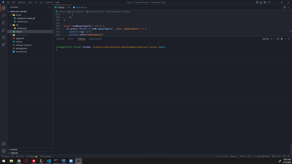

# Employee Tracker

  

  ***
  ## Table of Contents
  - [Description](#description)
  - [Visual Presentation](#visual-presentation)
  - [Technologies Used](#technologies-used)
  - [Installation](#installation)
  - [Usage](#usage)
  - [Contribution](#contribution)
  - [Testing](#testing)
  - [Additional Info](#additional-info)

  ***
  ## Description
  Developers are often tasked with creating interfaces that make it easy for non-developers to view and interact with information stored in databases. Often these interfaces are known as CMS, or Content Management Systems. This program builds a solution for managing a company's employees using node, inquier, and MySql.

  ***
  ## Technologies Used
  Used node, inquier, and MySql.
  
  ***
  ## Visual Presentation
  

  ***
  ## Installation
  Download the program from github and run 'npm i' to install the package dependencies.

  ***
  ## Usage
  To help companies manager their employee databases with ease.

  ***
  ## Contribution
  Any can contribute, simply fork the github repo and add what you want.

  ***
  ## Testing
  N/A

  ***
  ## Additional Info
  - Github: TabuHana(https://github.com/TabuHana)
  - Email: nate31196@outlook.com
